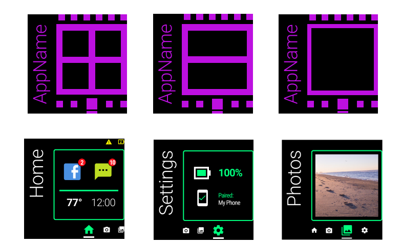
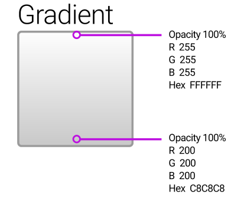
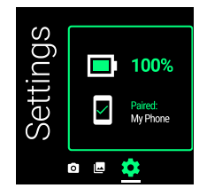

### Menu

- [Vuzix_test]
- [Animation Resources]
- [Material Design]
- [Software Design Instruction]
- [functions of the app]
- [documentation]

# Vuzix-test

using Vuzix Blade 2 harware settings, software instruction
https://d2iankuf53zudv.cloudfront.net/Content/Upload/PDFs/Vuzix_Blade_UX_Design_Guidelines_v2.pdf

# Animation Resources

https://github.com/material-components/material-components-android/blob/master/docs/theming/Motion.md

### Android Doc Site
https://developer.android.com/develop/ui/views/animations/overview

### Common Gesture Detection
https://developer.android.com/develop/ui/views/touch-and-input/gestures/detector#java

# Material Design
https://m3.material.io/

# Threading (for online database)
https://developer.android.com/topic/performance/threads
https://developer.android.com/guide/components/processes-and-threads
thread safety: Thread safety is the avoidance of data races--situations in which data are set to either correct or incorrect values, depending upon the order in which multiple threads access and modify the data.

# [Software Design Instruction](https://d2iankuf53zudv.cloudfront.net/Content/Upload/PDFs/Vuzix_Blade_UX_Design_Guidelines_v2.pdf)

1. centerring the UI elemtents (can only focus on one single element)
***
2. the left-most swipe ALWAYS means goes up to the previous app level, such as retrun to previous page or menu
***
3. for readablity of the app, use core color pallet #00FF7D (green), #FFFFF (white), #F2F100(yellow), #FC101B(red), high contrast colors
***
4. typography: donts of Roboto family is recommended, texts no smaller than 40px (min. 25px, not recommended for large quantities of text)
***
5. layout with app name on the left side and rail on the bottom, ass little padding as possible to make use of the full screen  

***
6. theme
    * light:  
    
    
    * dark:  
      
    dark color displayed as "no color at all"
***
7. icons: easily recognizable (also wehn scaled to smaller size (30 x 30 px @ 1x))
***
8. [voice command](https://d2iankuf53zudv.cloudfront.net/Content/Upload/PDFs/Vuzix_Blade_UX_Design_Guidelines_v2.pdf#page=20) that is useful for the test app:  
- go left / previous (navigation of menu/list)
- go right / next
- select this
- confirm (when deleting lists/items)
- cancel
- go down (navigation of items)
- go up
- go home (menu)
***
9. [gestures for navigating the app](https://d2iankuf53zudv.cloudfront.net/Content/Upload/PDFs/Vuzix_Blade_UX_Design_Guidelines_v2.pdf#page=22) and corresponding functions inside code:
- select(one finger, single tap)
- menu(one finger one second)
- swipe up and down(one finger)
- swipe forward and backward(one finger)

# Functions of the App

1. menu: all lists, deleted list, finished list(archive), to-do list
2. ### list feature
    * check list mode  
    * sequence mode (steps must be completed in specific sequence, otherwise show warning) 

    ### list display 
    * display items/steps in total  
    * display progress bar  
    * display description when user swipe up  
    * display containing items when user swipe up two times  
    * directly display items (and description) when swipe up with two fingers  

    ### items display
    * when clicking on item, shows up selection bar, swipe right for completed, swipe right for  quiting selection bar, return back to items view  

# Documentation

 - how to focus single View in center of the screen
 - animation used between activities
 - application architecture - how it works

# Android Studio quick beginner reference
## Font Size
 - sp: scaled pixels, adjusted accroding to the current density and the user preferable font size
 - dp:
 - px:

 test size preset:

## Grundidee der App
 Von den Industrie- und Militärbereichen bis zur alltäglichen Unterhaltung hilft uns die erweitere Realität(Augmented Reality) schon auf ganz reichliche Art und Weise. Dazu werden für verschiedene Nutzbedingungen und -bedarf

## Emulator Set-Up
für die Hardware-Simulation braucht man zusätzlich zu den bereit gestellten Geräten noch die Source Datei für die Vizux Blade 2 aus [der offizielle Website](http://files.vuzix.com/Content/Upload/vuzix-blade_v2.xml) abholen. Man muss außerdem in <Tools-><SDK Manager> gehen und die empfehlende System Image herunterladen.  Für die System-Image wählen wir laut [der Seite](https://intercom.help/vuzix/en/articles/6233028-creating-a-device-profile)die API Android 11.0 (R) aus und die API installieren.
In Design Mode muss man das richtige "Reference Device" hinzufügen (Add Device - Vuzix Blade)

## Grundlegende Design Set-up

### Textgröße

### Textfarben

### Animation
- wenn eine Liste gelöscht wird (ausgeblendet, durchgestriechen)
- wenn eine Liste erledig wird (bewegt sich zum Ende der Liste)

- wenn man nach links oder rechts das Element/View swipt, wird das Element auf der Mitte des Bildschirms verankert/fixiert
    Realisierung:
### Layout

- Menu
- Editor (um Liste und Elemente hinzuzufügen)
- Up Coming
- Deleted